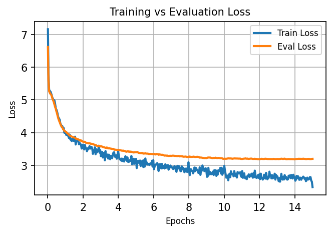

# NumPy-AI

**Deep Learning from First Principles**

NumPy-AI is an educational framework that strips away the "black box" of modern libraries while maintaining PyTorch-like structure and conventions. Built entirely from scratch with NumPy/CuPy and Python, it implements the full deep learning stack manually: neural network modules, backpropagation, optimizers, tokenizers, and training pipelines. The library provides a transparent view of every computation, scaling from simple layers to a multi-million-parameter generative Transformer.

> **Note:** This project is designed for education, not production. It's significantly slower than PyTorch/JAX and implements backpropagation manually rather than using autograd.

## What's Inside

**⚙️ Backend** (`backend.py`)
- Unified interface (`xp`) that supports both NumPy (CPU) and CuPy (GPU)
- Configure once via `.env`
- Utility functions like `to_cpu()`, `to_gpu()` and `get_device()` for device management

**🧱 Core Modules** (`modules/`)
- `attention.py` - Manual MHA / MQA / GQA with explicit QKV projections and backward pass
- `linear.py` - Dense layers with manual gradient computation
- `layer_norm.py` - Layer normalization for training stability
- `embeddings.py` - Token embeddings
- `rope.py` - Rotary Positional Embeddings (RoPE)
- `optimizers.py` - AdamW with decoupled weight decay
- `schedulers.py` - CosineAnnealingLR, StepLR, ReduceLROnPlateau
- `gradient_clipping.py` - Gradient norm clipping
- `losses.py` - Cross-Entropy Loss, Mean Squared Error (MSE), Mean Absolute Error (MAE)
- `activations.py` - GELU, ReLU, Softmax, and derivatives
- `mlp.py` - Standard Transformer MLP block (FC -> GELU -> FC)


**🏗️ Architectures** (`architectures/`)
- `transformer.py` - Complete Transformer with causal masking

**🔡 Tokenization** (`tokenization/`)
- `bpetokenizer.py` - Byte Pair Encoding (BPE) from scratch, implementation highly inspired by: https://jytan.net/blog/2025/bpe/

**📊 Training Infrastructure** (`data_utils/`)
- `dataset.py` - Minimal Dataset interface (`__len__`, `__getitem__`) with an array-backed implementation
- `dataloader.py` - Batching and shuffling logic

## Project Structure

```
numpy-ai/
├── backend.py              # NumPy/CuPy abstraction layer
├── architectures/          # High-level models
│   └── transformer.py
├── modules/                # Core building blocks
│   ├── attention.py
│   ├── linear.py
│   ├── embeddings.py
│   ├── rope.py
│   ├── layer_norm.py
│   ├── optimizers.py
│   ├── schedulers.py
│   ├── losses.py
│   ├── activations.py
│   ├── gradient_clipping.py
│   └── mlp.py
├── tokenization/           # BPE tokenizer
│   └── bpetokenizer.py
├── data_utils/             # Data pipeline
│   ├── dataset.py
│   └── dataloader.py
├── train_mnist_mlp.py      # Simple MLP example
├── train_shakespeare.py    # Transformer training
└── inference_transformer.py # Text generation
```

## Prerequisites and Setup

**Requirements:**
- Python 3.8+
- NumPy
- python-dotenv
- CuPy (optional, for GPU support)

**Installation:**
```bash
# Clone the repository
git clone https://github.com/DanFosing/numpy-ai.git
cd numpy-ai

# Install dependencies
pip install numpy python-dotenv

# (Optional) Install CuPy for GPU acceleration
# On CUDA (NVIDIA GPU), please note you need to have NVIDIA CUDA Toolkit installed:
pip install cupy-cuda12x  # Match your CUDA version

# On ROCm (AMD GPU and APU), please note you need to have ROCm installed:
pip install cupy-rocm-7-0 # Match your ROCm version
```

**Configuration:**

Create a `.env` file in the project root:
```env
BACKEND_TYPE=numpy  # or 'cupy' for GPU
```

## Examples

### 1. MNIST Handwritten Digit Classifier

**File:** `train_mnist_mlp.py`

A minimal 784→128→10 MLP (101,770 parameters) that demonstrates core concepts: forward pass, backpropagation, and gradient descent.

**Training output:** # CPU training
```
Epoch 1/30, Loss: 0.2944
Epoch 2/30, Loss: 0.2305
Epoch 3/30, Loss: 0.1870
Epoch 4/30, Loss: 0.1660
Epoch 5/30, Loss: 0.1401
...
Epoch 30/30, Loss: 0.0297
Time taken: 34.66 seconds
Test Accuracy: 97.68%
```

**Run it:**
```bash
python train_mnist_mlp.py
```

---

### 2. Shakespeare Transformer
**Files:** `train_shakespeare.py`, `inference_transformer.py`, pretrained weights in `weights/transformer_3.16M`
A 3.16M-parameter generative model trained on the TinyShakespeare dataset.

**Architecture:**
```python
Vocabulary: 512 BPE tokens
Parameters: 3,155,456 (3.16M)
Layers: 4
Embedding Dimension: 256
Attention: Grouped-Query (8 query heads, 4 KV heads)
FFN Hidden Dim: 1024
Max Sequence Length: 512
Training Sequence Length: 128
```

**Training Configuration:**
```python
Optimizer: AdamW (lr=1.5e-3, weight_decay=0.03)
Scheduler: Cosine Annealing (eta_min=5e-4)
Gradient Clipping: max_norm=0.8
Batch Size: 32
Epochs: 15
Dropout: 0.1
```

**Training:**
```bash
python train_shakespeare.py --epochs 15 --batch_size 32
```

**Inference:**
```bash
python inference_transformer.py \
  --prompt "ROMEO:" \
  --steps 100 \
  --temp 0.5 \
  --top_k 20 \
  --top_p 0.9
```

**Generation Examples:**

**High Temperature (0.7, top_k=40, top_p=0.9) - Creative**

Prompt:
```
ROMEO:
```

Output:
```
Palease you weller;
Then my regrage?

DUKE VINCENTIO:
I know you to-morrow, and not die.

ISABELLA:
Ah, sir, madam:
Come, sir, good hearts.

AUTOLYCUS:
No, by my heart.
```

---

**Low Temperature (0.01, top_k=1, top_p=0.999) - Deterministic**

Prompt:
```
First Citizen:
Before we proceed any further, hear me speak.

All:
Speak, speak.

First Citizen:
```
Output:
```
His did I will not.

CORIOLANUS:
Why, my lord,
And I have done to me.

CORIOLANUS:
Why, my lord,
It not bearing to the Tower, and then,
And make a brother, orthy of the royal prove.

KING RICHARD
```

---

**Medium Temperature (0.5, top_k=10, top_p=0.8) - Balanced**

Prompt: 
```
First Citizen: Speak, speak! Why are you
```

Output:
```
Therefore, and then sentleeps, they are they say
Therefore poor brothers, they are too much,
Where they have did nothing but then their chamber
To worthy of the prophecialment of the present
Because to their father's
```

---
**Output analysis:**
The model generates text in a Shakespearean play style, using dialogue structure, character names, and recurring themes common in Shakespeare’s works. Outputs vary with sampling settings, becoming more creative or more repetitive, but remain stylistically consistent, creating new sentences rather than copying exact wording from the plays.

---

## Visualizing training
**Training losses:**
```
Average of last 5 train losses: 2.5293
Average of last 5 eval losses: 3.1924
```

**Loss plot:**



---
## Design Philosophy

- **Readable and explicit code**
- **Modular components following PyTorch naming conventions and style**
- **Real experiments that converge and generate coherent output**

